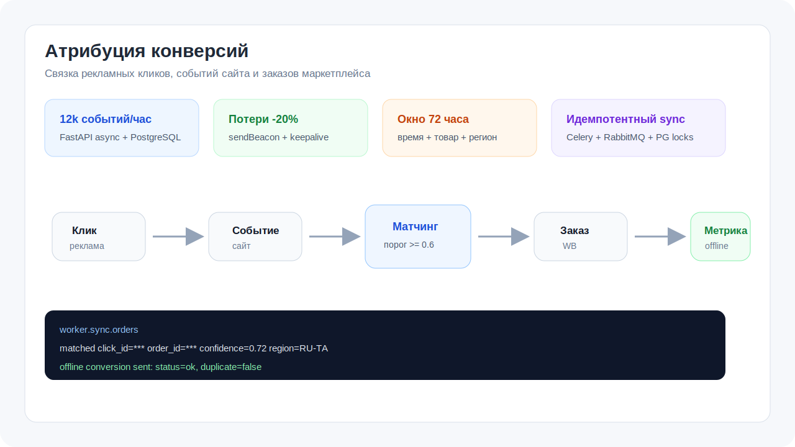
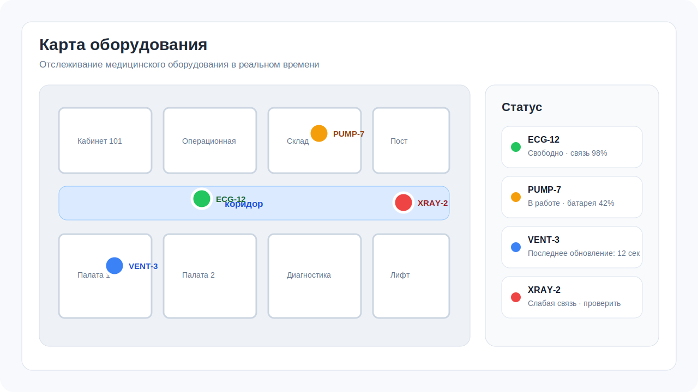

# Ахмед Саиф

Python backend-разработчик: FastAPI, Django/DRF, PostgreSQL, Docker, CI/CD, Celery, Redis, RabbitMQ/Kafka.

Делаю REST API, интеграции внешних сервисов, фоновые задачи и production-like запуск. Интересны backend-команды, где важны надежность, понятная архитектура, тесты и измеримый результат.

## Стек

`Python` · `FastAPI` · `Django` · `DRF` · `PostgreSQL` · `Docker` · `Nginx` · `Celery` · `Redis` · `RabbitMQ` · `Kafka` · `Pytest` · `Linux` · `CI/CD`

## Проекты

### Атрибуция конверсий: Yandex.Direct API x Yandex.Metrika API x WB/OZON API

Коммерческий backend-проект для связки рекламных кликов с заказами маркетплейса и отправки оффлайн-конверсий в Метрику для оптимизации ставок.

- ~12k событий/час на FastAPI async и PostgreSQL.
- Эвристический матчинг: время, товар, регион, confidence threshold.
- Celery + RabbitMQ для фоновых задач, PostgreSQL advisory locks для идемпотентного sync.
- Telegram-бот для операционных уведомлений.
- Проект в продакшене, детали под NDA. Архитектуру и метрики могу разобрать на собеседовании.

### Геотрекинг оборудования

Фриланс-проект для отслеживания медицинского оборудования в реальном времени на карте здания.

- Интеграция с проприетарным API трекера и нестандартными HTTP-сценариями.
- Прием, обработка и хранение координат оборудования.
- Интерактивная карта, статусы устройств и обновление данных.
- Публичный MVP: [GpsTrack](https://github.com/A7med373/GpsTrack). Финальная версия приватная.

### Foodgram

Fullstack-приложение для рецептов, подписок, избранного и списка покупок.

- Django REST Framework, PostgreSQL, React, Docker, Nginx.
- Авторизация, рецепты, ингредиенты, теги, подписки, корзина.
- Репозиторий: [foodgram-st](https://github.com/A7med373/foodgram-st)

### Barter Platform

MVP-платформа для обмена товарами между пользователями.

- Django, PostgreSQL, Docker, Nginx, Gunicorn, тесты.
- Регистрация, объявления, фильтры, предложения обмена и статусы.
- Репозиторий: [barter_platform](https://github.com/A7med373/barter_platform)

## Еще

- [UpTrader](https://github.com/A7med373/UpTrader) - Django tree menu с template tags и отрисовкой за один запрос к БД.
- [miniAPI_tasks](https://github.com/A7med373/miniAPI_tasks) - небольшой FastAPI REST API с тестами.
- [GpsTracker](https://github.com/A7med373/GpsTracker) - публичный сервисный вариант GPS-трекинга.

## Контакты

- Telegram: [@AlasriAhmedSaif](https://telegram.me/AlasriAhmedSaif)
- Email: [a7medsaif2005@gmail.com](mailto:a7medsaif2005@gmail.com)
- LinkedIn: [Ahmed Saif Alasri](https://www.linkedin.com/in/ahmed-saif-alasri/)
